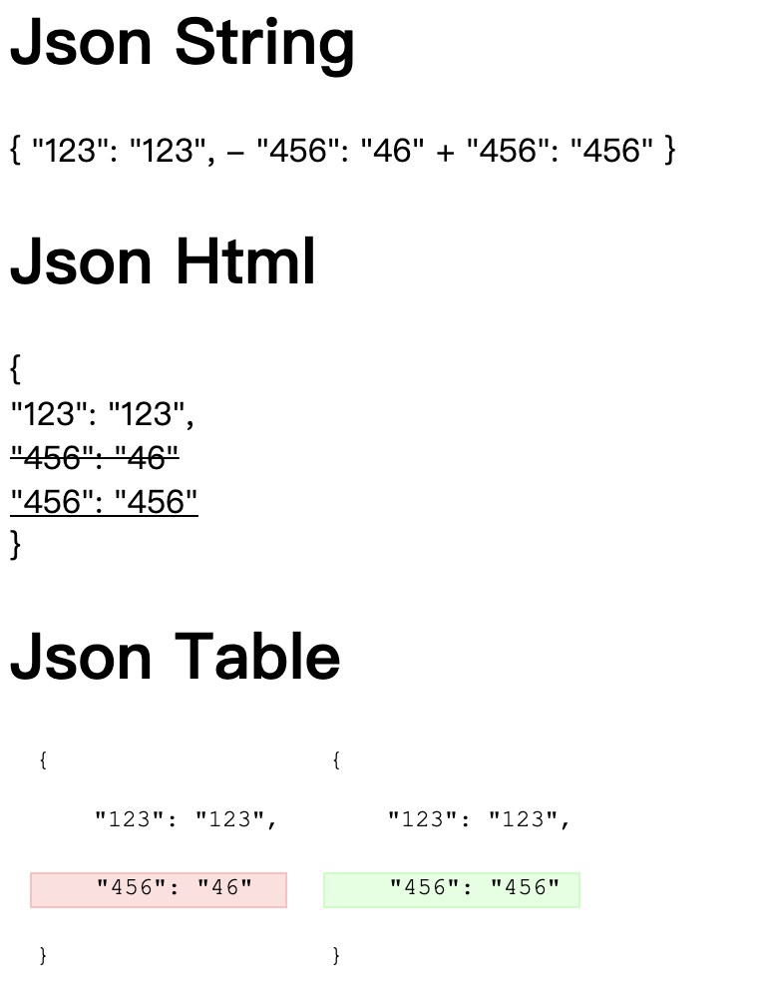
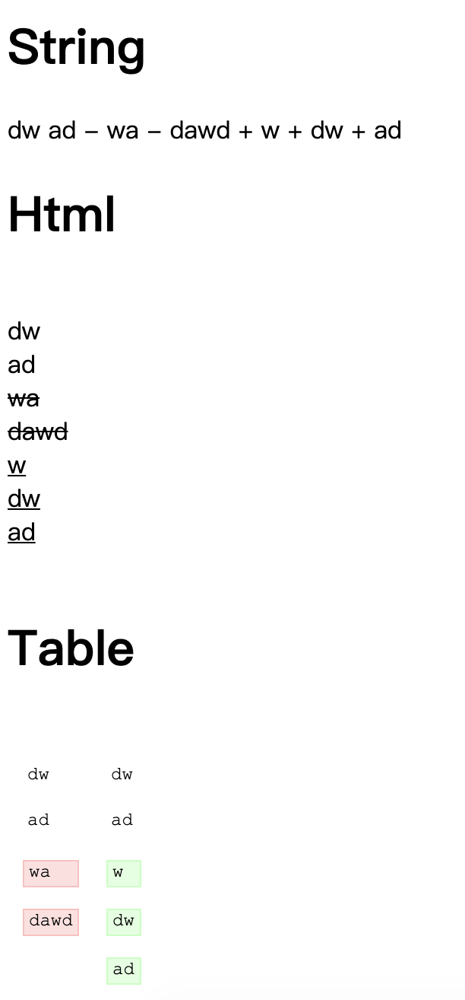

# phpdiff

## 项目背景
公司最近要开发一个组内的接口测试工具 diff功能就交给我了 通过google搜索到一位大佬的轮子 我自己也没有想重新写一个 所以修改了下大佬的轮子并且添加了css就用了

欢迎大家follow，star

## 使用方法
1. 直接git -b use git@github.com:liuyuhang791034063/phpdiff.git
2. 将Diff.php导入项目
3. 在前端文件中导入diff_style.css

## 功能介绍
项目主要功能是用于php实现文本或这json的diff功能

**比较功能方法：**

- compare($string1, $string2, $compareCharacters = False）

前两个参数是需要对比的文本或者json，第三个参数为True将会逐个字符比较，否则逐行比较 

- compareFiles($file1, $file2, $compareCharacters = false)

该方法可以直接传入文件名，对文件中文本进行diff

以上两个方法最后都会返回一个数组类型的数据 将传入下面的输出方法中

**输出功能方法：**

- toString($diff, $separator = "\n")
- toHTML($diff, $separator = '\ ')
- toTable($diff, $separator = '\ ')

上面的三个方法中第二个参数都是会在处理diff数组中每条数据后添加的

## 功能演示

### json三种输出显示

### 文本三种输出显示

## 引用
[大佬的网址](http://code.iamkate.com/php/diff-implementation/)

## 联系方式：
QQ：791034063   
Wechat：liuyuhang791034063   
CSDN：https://blog.csdn.net/Sun_White_Boy   
Github：https://github.com/liuyuhang791034063   
